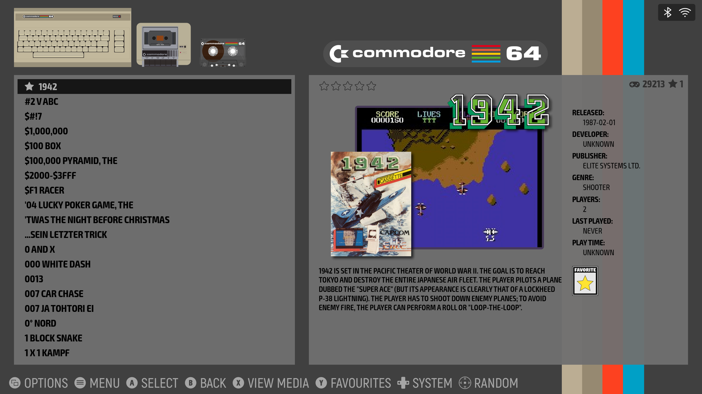

# GameBase to ES-DE Metadata Converter

A platform-agnostic, dependency-free tool to convert Commodore 64 GameBase Access databases (`GBC_v19.mdb`) into metadata and media paths readable by **EmulationStation Desktop Edition (ES-DE)**.

> [!NOTE]
> **ES-DE vs. Legacy EmulationStation:**
> This converter targets **ES-DE (EmulationStation Desktop Edition)**, which is the newer, active fork hosted at [GitLab](https://gitlab.com/es-de/emulationstation-de)

It generates a portable `gamelist.xml` file with parent-relative paths (`../`) so that ES-DE can access the existing GameBase screenshots and cover art without copying, moving, or duplicating any files.



---

## Features

- **Platform Agnostic:** Runs on Windows, Linux, and macOS.
- **Direct Database Parsing:** Uses a pure-Python Access database parser (`access-parser`), avoiding the need for system-level ODBC/OLEDB drivers or OS subsystems.
- **Folder Flattening (Optional):** Automatically creates a `flatten.txt` file inside the ROM directory, instructing ES-DE to display all games in a single flat list, hiding the alphabetical/numerical subfolders (`0-9`, `A`, `B`...) common in GameBase.
- **Zero File Duplication:** References existing folders (`Screenshots/` and `Extras/`) using parent-relative paths (`../`) from the `Games/` directory.
- **Cross-Platform Paths:** Converts all backslashes (`\`) to forward slashes (`/`) so that the XML parses correctly on Windows, Linux, macOS, and Android.
- **Decadal Year Mappings:** Translates GameBase special years (e.g. `9991` for the 1980s, `9992` for the 1990s) into valid ES-DE release dates, and filters out unknown release years.
- **Standardized Ratings:** Converts GameBase `0-5` ratings into ES-DE's standard `0.0 - 1.0` scale.
- **Unified Descriptions:** Merges short comments and long-form database reviews into a single `<desc>` field.
- **Automated Virtual Environment:** Includes helper scripts that automatically set up a local Python virtual environment and install the required dependencies on the first run.

---

## Supported Platforms

The converter is platform-agnostic and will parse any database matching the standard GameBase database schema. The following systems have been explicitly converted and verified:

- **Commodore 64:** ~30,000 games
- **Commodore Amiga:** ~3,036 games
- **Atari 800:** ~6,981 games
- **Atari 2600:** ~573 games
- **Acorn BBC Micro:** ~2,380 games
- **Sinclair ZX Spectrum:** ~17,130 games
- **VIC-20:** ~2,260 games

*Other GameBase databases (such as Commodore 16/Plus 4, Atari ST, etc.) should work out of the box as well!*

> [!WARNING]
> **Screenshots Folder Compatibility:**
> At the moment, the `Screenshots` folder structure or format in standard GameBase is not fully compatible with ES-DE's direct relative path matching. Screenshots may not display out of the box in ES-DE.

---

## Directory Structure Requirement

For parent-relative path mapping to resolve correctly, keep the standard GameBase directory structure:

```
<GameBase C64 Root>/
├── GBC_v19.mdb               # The GameBase Access Database
├── run_converter.bat         # Windows Launcher
├── run_converter.sh          # Linux/macOS Launcher
├── convert_gamebase.py       # Main converter script
├── Games/                    # Contains ROM files (e.g., 0/, a/, b/...)
│   ├── gamelist.xml          # [Generated] Output metadata file
│   └── flatten.txt           # [Generated/Optional] Hides folder structures in ES-DE
├── Screenshots/              # Contains Screenshots (e.g., 0/, a/, b/...)
└── Extras/                   # Contains Covers/Manuals
    └── Cover/                # Subdirectory containing covers (e.g., 0/, a/...)
```

---

## How to Run

By default, when you run the script, it will ask you if you want to flatten folders in ES-DE (interactive terminal) or default to flattening (`Yes`). You can also control this behavior using command-line arguments:

- `--flatten`: Force folder flattening (creates `Games/flatten.txt`).
- `--no-flatten`: Disable folder flattening (removes `Games/flatten.txt` if present).
- `--mdb <path>`: Specify a custom path to your `.mdb` database file.

### Windows
1. Double-click `run_converter.bat`, or run it from command prompt/PowerShell:
   ```cmd
   .\run_converter.bat
   ```
2. To pass arguments on Windows, run via cmd/PowerShell:
   ```cmd
   .\venv\Scripts\python.exe convert_gamebase.py --flatten
   ```

### Linux and macOS
1. Open a terminal, navigate to the folder, and mark the shell script as executable:
   ```bash
   chmod +x run_converter.sh
   ```
2. Run the script:
   ```bash
   ./run_converter.sh
   ```
3. To pass arguments on macOS/Linux:
   ```bash
   ./run_converter.sh --flatten
   ```

---

## EmulationStation (ES-DE) Integration Instructions

Follow these steps to load your converted Commodore 64 GameBase library in ES-DE:

### Step 1: Configure ES-DE to Read Local gamelist.xml Files
By default, ES-DE reads metadata from a centralized system-specific folder. To make it read the generated `gamelist.xml` file directly from your ROM folder:
1. Open your ES-DE configuration settings file:
   - **Windows:** `%USERPROFILE%\.ES-DE\settings\es_settings.xml` (typically under `C:\Users\<username>\.ES-DE\settings\es_settings.xml` or `ES-DE\settings\es_settings.xml`)
   - **macOS:** `~/.ES-DE/settings/es_settings.xml`
   - **Linux:** `~/.ES-DE/settings/es_settings.xml`
2. Search for the setting `<bool name="LegacyGamelistFileLocation" value="false" />`.
3. Change its value to `true`:
   ```xml
   <bool name="LegacyGamelistFileLocation" value="true" />
   ```
4. Save and close the file.

### Step 2: Point ES-DE to the Converted Games Folder
Since our `gamelist.xml` is placed inside the `Games/` directory and maps ROM files relative to it, you must configure ES-DE's `c64` ROM directory to point directly to `<GameBase C64 Root>/Games`.
1. Move or symlink `<GameBase C64 Root>/Games` into your ES-DE `roms/c64` directory, OR
2. Configure ES-DE to use a custom directory path for `c64` pointing directly to your GameBase `Games` directory.

### Step 3: Run ES-DE
Launch ES-DE. It will scan the `c64` ROMs folder, read the `gamelist.xml` inside it, and load your GameBase library.
All metadata (names, descriptions, developers, publishers, genres, release dates, and ratings) along with their corresponding screenshots and cover images will display correctly!
If flattening is enabled, all games will be presented in a single flat list, completely hiding the subfolder hierarchy.
